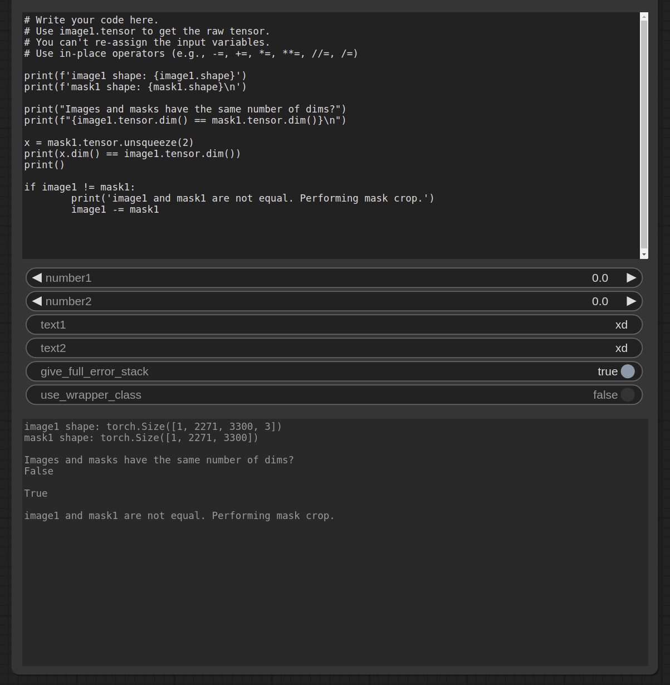

# Python Interpreter ComfyUI Node

- For debugging, parsing data, generating random values, converting types, testing custom nodes faster.
- Reference and use variables in the code using the same names as the inputs in the UI
- Wrapper class around tensors with operator overloading for doing common image manipulation tasks.I might remove this aspect

